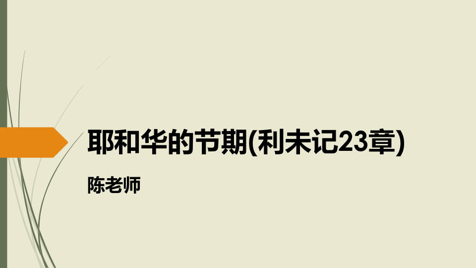
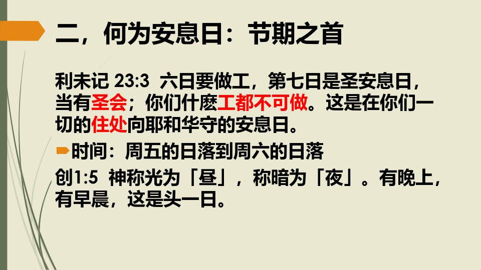
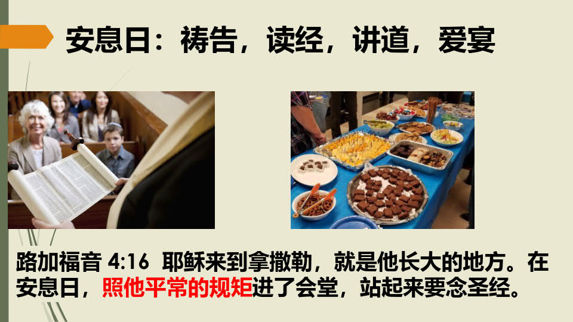

# 221218 主日证道 :  耶和华的节期
## 讲员：陈老师
## 经文：利未记 23章
<audio controls src="./221218.mp3"></audio>

妥拉学习网站：https://torah4chinese.org/

### ———————————————————

## [主日证道汇总](https://nccchurch.github.io/Sermons/)
